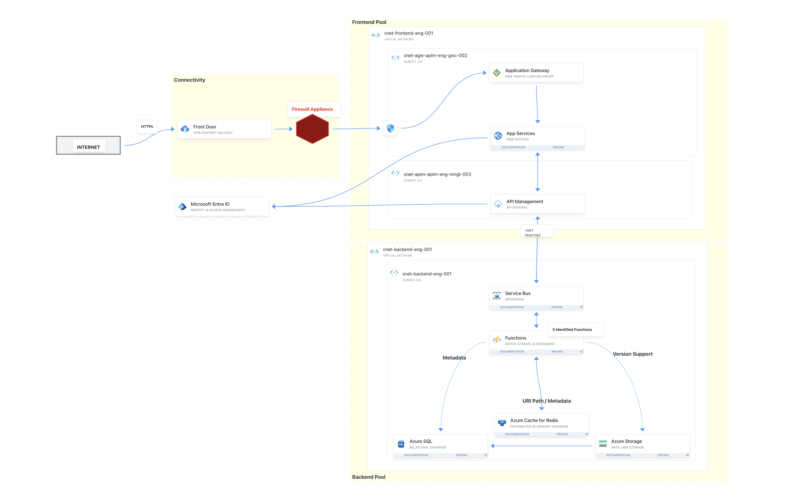

---

# Microservices Deployment

## Overview

This repository contains the ARM templates and related infrastructure-as-code (IaC) files required to deploy a microservices-based application on Microsoft Azure. The application consists of several independently deployed and managed services, including Function Apps, SQL databases, Redis Cache, Service Bus, Azure Front Door, Application Gateway, and App Services. Each service plays a specific role in the overall architecture, contributing to the scalability, resilience, and flexibility of the application.

## Architecture


### Architecture Diagram

This diagram illustrates the architecture of the microservices-based application.



### Components

- **Function App**: Serves as the entry point for the application, processing HTTP requests, queue messages, and other triggers.
- **SQL Database**: Provides persistent storage for application data. The database is hosted on an Azure SQL Server instance.
- **Redis Cache**: A distributed, in-memory cache that helps improve the performance of the application by reducing the load on the SQL Database.
- **Service Bus**: Facilitates communication between services using a reliable messaging system, supporting asynchronous operations.
- **Storage Account**: Used for storing files, such as blobs, that are processed or generated by the application.
- **Azure Front Door**: Acts as a global load balancer, providing fast and secure content delivery by routing traffic to the nearest application backend.
- **Application Gateway**: Provides advanced routing and load balancing capabilities within the Azure region, ensuring secure delivery of application content.
- **App Service**: Hosts the web applications and APIs, providing a fully managed platform for building, deploying, and scaling web apps.

## Deployment Instructions

### Prerequisites

- An active Azure subscription.
- Azure CLI installed on your local machine.
- Appropriate permissions to deploy resources in the Azure subscription.
- Git installed on your local machine.

### Deploying the Infrastructure

The deployment process involves running the ARM templates to provision the required Azure resources. Below are the steps to deploy each component.

#### 1. Deploy the Function App

```bash
az deployment group create --resource-group <ResourceGroupName> --template-file azure-function-prem-template.json --parameters @parameters.json
```

#### 2. Deploy the SQL Database

```bash
az deployment group create --resource-group <ResourceGroupName> --template-file azure-sql-template.json --parameters @parameters.json
```

#### 3. Deploy the Redis Cache

```bash
az deployment group create --resource-group <ResourceGroupName> --template-file redis-cache-template.json --parameters @parameters.json
```

#### 4. Deploy the Service Bus

```bash
az deployment group create --resource-group <ResourceGroupName> --template-file service-bus-template.json --parameters @parameters.json
```

#### 5. Deploy the Storage Account

```bash
az deployment group create --resource-group <ResourceGroupName> --template-file storage-account-template.json --parameters @parameters.json
```

#### 6. Deploy the Azure Front Door

```bash
az deployment group create --resource-group <ResourceGroupName> --template-file azure-front-door-template.json --parameters @parameters.json
```

#### 7. Deploy the Application Gateway

```bash
az deployment group create --resource-group <ResourceGroupName> --template-file app-gateway-template.json --parameters @parameters.json
```

#### 8. Deploy the App Service

```bash
az deployment group create --resource-group <ResourceGroupName> --template-file app-service-template.json --parameters @parameters.json
```

### Configuration

- Each ARM template includes parameters that need to be customized for your environment. Update the `parameters.json` file or pass the parameters directly via the command line.
- Tags have been added to all resources for better resource management and cost tracking.

### Post-Deployment

After the resources have been deployed, you can access the Function App, SQL Database, App Service, and other services through the Azure portal or via Azure CLI. Azure Front Door and Application Gateway should be tested to ensure proper routing and load balancing. Make sure to test each service to verify that the deployment was successful.

---
